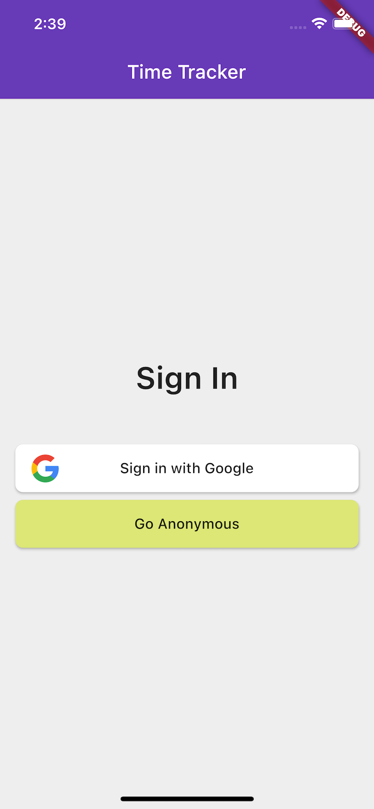

# Time Tracker

A time tracker app based on Flutter and Firebase.

### Setup

This app assumes a pre-configured Firebase project. To get one, follow the [Prerequisites](https://firebase.flutter.dev/docs/overview#prerequisites), [Installation](https://firebase.flutter.dev/docs/overview#installation) and platform-specific [setup](https://firebase.flutter.dev/docs/overview#platform-setup) steps.

Note that following sign-in methods also need to be enabled in Firebase console (Authentication -> Sign-in method):
1. Google
2. Anonymous

### Screenshots

